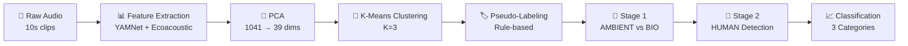

# 🌊 Reef Acoustic Monitoring - Weakly-Supervised Soundscape Classification

<div align="center">


**Automated classification of underwater reef soundscapes using machine learning**  
*No manual labeling required*

[Overview](#-overview) • [Features](#-key-features) • [Methodology](#-methodology) • [Results](#-results) • [Structure](#-project-structure)

</div>

---

## 🎯 Overview

This project develops an **automated classification system** for marine acoustic data from long-term reef monitoring. Using **weakly-supervised learning**, the system identifies different soundscape types—**biological activity (BIO)**, **ambient ocean sounds (AMBIENT)**, and **anthropogenic noise (HUMAN)**—without requiring extensive manual annotation.

### Why This Matters

- 🐠 **Marine Conservation**: Understand reef health through acoustic monitoring
- ⏱️ **Scalability**: Process millions of audio clips automatically
- 💰 **Cost-Effective**: No expensive manual labeling required
- 🔬 **Research Tool**: Enable long-term ecosystem monitoring

---

## ✨ Key Features

### 🎵 Multi-Source Feature Extraction
- **YAMNet Embeddings** (1,024 dims) - Pre-trained deep learning features
- **Ecoacoustic Indices** (17 dims) - Domain-specific acoustic metrics
- **PCA Dimensionality Reduction** - Efficient 39-dimensional representation

### 🤖 Weakly-Supervised Learning Pipeline
- **Unsupervised Clustering** - K-Means discovers natural patterns
- **Automated Pseudo-Labeling** - Rule-based heuristics assign categories
- **Two-Stage Classification** - Hierarchical AMBIENT → BIO → HUMAN detection

### 🧪 Novel Validation Approach
- **Robustness Testing** - Perturbation-based consistency analysis
- **Ensemble Validation** - Multi-model agreement (5 architectures)
- **No ground truth required** - Confidence metrics without manual labels

---

## 🔬 Methodology



### Pipeline Steps

1. **📊 Feature Engineering**
   - Extract acoustic embeddings and indices
   - Reduce dimensionality while preserving variance

2. **🔍 Unsupervised Discovery**
   - Cluster audio clips by acoustic similarity
   - Compare K-Means, HDBSCAN, and GMM

3. **🏷️ Automated Labeling**
   - Apply acoustic ecology principles
   - Generate pseudo-labels with confidence scores

4. **🎯 Supervised Classification**
   - Train multi-stage detector on pseudo-labels
   - Validate using robustness and ensemble methods

---

## 📈 Results

### Model Performance

| Metric | Score | Status |
|--------|-------|--------|
| **Clustering Quality** (Silhouette) | 0.769 | ✅ Excellent separation |
| **Stage 1 Accuracy** | 99.90% | ⚠️ Requires larger test set |
| **Robustness** | 0.998 | ✅ Stable predictions |
| **Model Agreement** | 0.999 | ✅ High consensus |

### ⚠️ Important Notes

- Current validation on **small test set (n=20)**
- Pseudo-labels not verified against expert annotations
- Stage 2 (HUMAN detection) in development
- Comprehensive validation needed before deployment

See [detailed evaluation](Result_Evaluation.md) for full analysis.

---

## 📁 Project Structure

```
reef_zmsc/
│
├── 📂 data/
│   ├── autolabeling_fixed/          # Pseudo-labeling results
│   │   ├── models/                  # Stage 1 classifier
│   │   └── results/                 # Cluster labels
│   │
│   ├── clustering/                  # K-Means, HDBSCAN, GMM
│   │   └── results_50k/             # Clustered data
│   │
│   ├── features/                    # Extracted features
│   │   ├── embeds_yamnet_50k/       # YAMNet embeddings
│   │   ├── embeds_ecoacoustic_50k/  # Ecoacoustic indices
│   │   ├── embeds_fused_50k/        # Combined features
│   │   └── embeds_preprocessed_50k/ # PCA features
│   │
│   ├── model_testing/               # Test predictions
│   │   └── results/
│   │
│   ├── model_validation/            # Robustness & agreement tests
│   │
│   └── two_stage_detector/          # Stage 2 (HUMAN) detector
│       ├── models/
│       └── results/
│
├── 📂 calibration/                  # Logger calibration files
├── 📂 cfg/                          # Configuration files
├── 📂 notebooks/                    # Jupyter analysis notebooks
├── 📂 scripts/                      # Python scripts
├── 📂 wav/                          # Raw audio data (PAPCA)
│
├── 📄 README.md                     # This file
├── 📄 Result_Evaluation.md          # Detailed validation report
└── 📄 requirements.txt              # Dependencies
```


## 🛠️ Technologies

| Category | Tools |
|----------|-------|
| **Language** | Python 3.10 |
| **ML/DL** | scikit-learn, TensorFlow, YAMNet |
| **Audio** | librosa, soundfile |
| **Data** | pandas, numpy, parquet |
| **Clustering** | K-Means, HDBSCAN, GMM |
| **Visualization** | matplotlib, seaborn |

---

## 📊 Dataset

- **Source**: Autonomous underwater acoustic recorders
- **Location**: Coral reef ecosystems (2 loggers)
- **Duration**: 271 days continuous monitoring
- **Total Clips**: 1,053,610 × 10-second segments
- **Training Set**: 15,392 clips (after deduplication)

